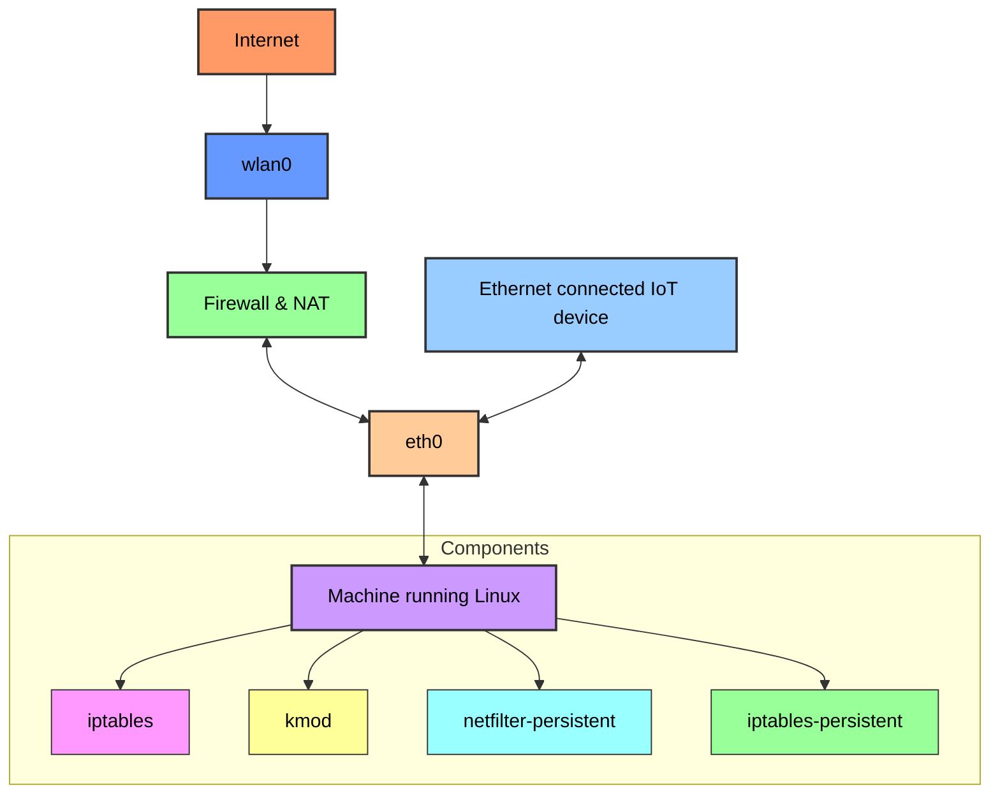

# Simple Firewall Nat

This service is designed to provide a simple firewall and NAT (Network Address Translation) functionality for Linux systems. It allows you to set up basic firewall rules and enable NAT to share an internet connection with devices on a local network.



## Requirements:
To ensure the firewall and NAT script operates correctly, you need to have the following packages installed on your system:

### Required Packages
#### iptables
Used to set up, maintain, and inspect the tables of IP packet filter rules in the Linux kernel.

#### kmod
Used for managing kernel modules, which are necessary for loading the appropriate network-related modules required by the script.

#### netfilter-persistent (Optional but recommended)
Provides a framework for managing firewall rules across reboots.

#### iptables-persistent (Optional but recommended)
Saves and restores iptables rules upon system startup and shutdown.

### Installation Instructions
Install the required packages using the following commands:

```bash
sudo apt-get update
sudo apt-get install iptables kmod
```

#### For persistent iptables rules (optional but recommended):
```bash
sudo apt-get install netfilter-persistent iptables-persistent
```

#### Verifying Installation
To verify the installation of iptables, you can run:
```bash
iptables --version
```

#### To verify the installation of kmod, you can run:
```bash
kmod --version
```

#### To check the status of netfilter-persistent and iptables-persistent (if installed):
```bash
sudo systemctl status netfilter-persistent
sudo systemctl status iptables-persistent
```
Ensure that these packages are properly installed and configured before running the firewall and NAT script.

## Key Points:
### Module Loading:
The script loads necessary kernel modules using depmod and modprobe.

### IP Forwarding:
Enables IP forwarding and dynamic address handling.

### Clearing Rules:
Clears any existing iptables rules and sets default policies to ensure a clean state before applying new rules.

### Forwarding Rules:
Allows outgoing connections from eth0 to wlan0.
Allows established and related incoming connections from wlan0 to eth0.
Logs any other forwarded packets.

### SNAT (MASQUERADE):
Enables SNAT (Source Network Address Translation) on wlan0 to allow devices on eth0 to access the internet via wlan0.

### Stopping the Firewall:
The stop_firewall function disables IP forwarding and clears all iptables rules, reverting to default policies.

### Usage Instructions:
#### Place the Script:
Save the script as `/etc/init.d/simple-firewall-nat`.

#### Make the Script Executable:

```bash
chmod +x /etc/init.d/simple-firewall-nat

#### Start the Firewall:
service simple-firewall-nat start

#### Stop the Firewall:
service simple-firewall-nat stop

#### Restart the Firewall:
service simple-firewall-nat restart

#### Check the Status:
service simple-firewall-nat status
```

### Conclusion:
This script is compatible with a raspberrypi / docker setup and provide the necessary firewall functionality,
allowing the management of NAT and forwarding rules for network interfaces.
